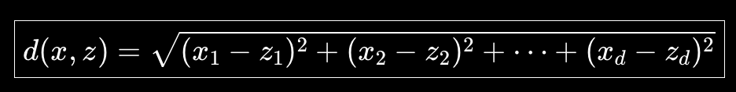
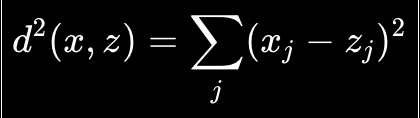
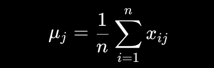
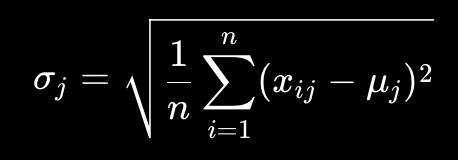
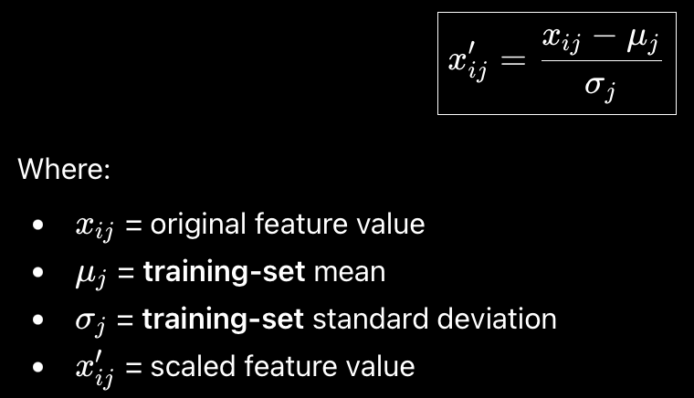
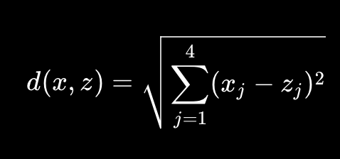

### k nearest neighbours
- is a supervised machine learning algorithm
- KNN is based on simple assumption, similar inputs -> tend to have similar outputs
- nearby points in feature space -> likely similar labels 
- KNN is a lazy learner 
- it just saves the scaled training data points during training.
- when we predict input comes in, it calculates the distances & performs the voting.


### iris dataset 
- has 150 rows 
- 4 features 
- 1 target -> species class 
- 3 species classes -> virginica, setosa & versicolor
- target is therefore y belongs to {0,1,2}
- features x = [sepal length, sepal width, petal length, petal width]

### implementation plan 
- load the dataset
- split the dataset into 80:20 
- scale the features to avoid one feature to dominantly affect the distance between 2 similar points
- create KNN model 
- train the model 
- predict using the model
- calculate accuracy 
- calculate confusion matrix 

### simplified plan 
- 1. data ingestion 
- 2. distance calculation 
- 3. sort top k 
- 4. take k 
- 5. vote 

### maths & theory to understand first
- iris always have 4 features, so we can use array of type [f62; 4] 
- distance calculation between 2 points x & z is done as 
​​
- this is just multi-dimensional euclidean distance formula 
- instead of calculating the square root of the distance we can just compare raw distance. 
- because if d1 < d2 then d1^2 < d2^2
- so we can just compare 


### scaling data 
- why scale because 
- 1. age 20-60
- 2. income 20,000 - 100,000
- 3. visits 1 - 20
- euclidean distance treats every dimension numerically 
- so the income becomes a dominating factor while calculating the whole distance and may lead to put similar points further away due to inflated distance 

### scaling using standardization 
- for each feature we will calculate 
- 1. mean of the feature
- 2. standard deviatoin 
- and calculate
- scaled value = original - mean / deviation 

### which data needs to be scaled
- we need to scale training data 
- we also need to scale the input in the similar fashion using the already calculated means & standard deviation of each feature 
- we don't recalculate mean or std. deviation 
- also we scaled the training data using the mean & std. dev. calculated from 80% of data and therefore remaining testing data also needs to be scaled with the same mean & std. dev.

### pipeline 
- get training data
- calculate mean 
- calculate std. deviations 
- scale training data
- save means & std. deviation 
- new flower input arrives
- scale using same means & std. deviation 
- calculate distance of input from other points 
- choose the points by taking K smallest distance  
- return the most repeated class from these as prediction 

### dataset in memory 
```js
dataset
┌─────────────────────────────────────────────┐
│ S │ S │ S │ S | S │ ... │ S │ S │ S │ S │ S │
└─────────────────────────────────────────────┘
  └──────────────┘       └───────────────┘
    train_data              test_data
     borrow                   borrow
```

### idiomatic mathematical expressions
 
- idiomatic code 
```rs
fn calculate_mean(data: &[Sample]) -> [f64; 4] {
    let mut sums = [0.0; 4];

    for item in data {
        for j in 0..4 {
            sums[j] += item.features[j];
        }
    }

    let length = data.len() as f64;

    for j in 0..4 {
        sums[j] /= length;
    }

    sums
}
```
- junior engg code 
```rs
fn calculate_mean(data: &[Sample]) -> [f64; 4] {
    let length = data.len() as f64;
    let mut feature_1_sum = 0.0;
    let mut feature_2_sum = 0.0;
    let mut feature_3_sum = 0.0;
    let mut feature_4_sum = 0.0;

    for item in data {
        feature_1_sum += item.features[0];
        feature_2_sum += item.features[1];
        feature_3_sum += item.features[2];
        feature_4_sum += item.features[3];
    }

    [
        feature_1_sum / length,
        feature_2_sum / length,
        feature_3_sum / length,
        feature_4_sum / length,
    ]
}
```

### calculate std deviaton formula & its code expression 

- xij : feature j of sample i 
- muj : mean of feature j 
- n : no of training samples
- sigmaj : standard deviation of feature j 
```rs
fn calculate_std_dev(data: &[Sample], means: &[f64; 4]) -> [f64; 4] {
  let mut squared_diffs = [0.0; 4];

  for item in data {
    for j in 0..4 {
      let diff = items.features[j] - means[j];
      squared_diffs[i] += diff * diff;
    }
  }

  let n = data.len() as f64;

  for j in 0..4 {
    squared_diffs[j] = (squared_diffs[j] / n).sqrt();
  }

  squared_diffs
}
```

### scaling data points using mean & std dev

- zscore scaling!

### euclidean distance calculation

- basically we will get an input point, we first scale it using our learned means & std-devs.
- then we calculate the distance of sample points from this point
- then arrange the distances in ascending order 
- choose top k smallest distances (maximum feature similarity)
- perform the voting and give back label in numeric form
- return / print the label after converting it from numeric to string format using decode_label() function.

### final prediction step 
- get user's data point 
- scale it using our learned means & std deviations
- find out distance between training points & user's point
- sort the top k smallest distance calculated 
- top k samples vote 
- predict numeric label
- decode numeric label into string